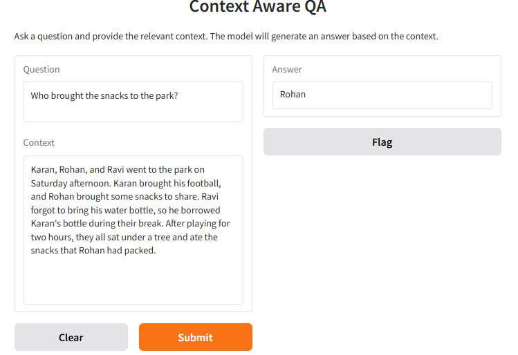
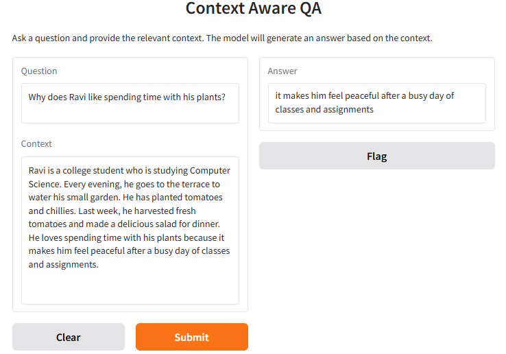

## Context-Aware Question-Answering System
A transformer-based Question Answering (QA) system fine-tuned on the Natural Questions dataset to generate relevant answers from document context. This project leverages the power of Google's FLAN-T5 model to understand and answer questions using surrounding context.

In simple words, when you provide the model with a question and its corresponding context, it generates an answer based on the information in the context.

---

  

  

> Try the model live in the [Hugging Face Space](https://huggingface.co/spaces/Raghav1221/context-aware-qa2)

---

## Project Highlights
- Fine-tuned **`flan-t5-small`** using Hugging Face Transformers and Datasets.
- Extracts structured context from the Natural Questions dataset.
- Preprocesses document tokens to build a context-rich input prompt for QA generation.
- Generates human-readable answers from contexts using trained model.
- Clean, modular Python codebase for both training and inference.

## Project Structure
| File / Folder | Description |
|---------------|-------------|
| `app.py` | Script for loading model/tokenizer and performing inference on a question + context |
| `train.py` | End-to-end script: loads Natural Questions subset, preprocesses data, fine-tunes the model |
| `requirements.txt` | List of Python packages needed for inference |
| `.gitignore` | Prevents loading unnecessary files |
| `assets` | Contains list of images for demo preview | 
| `README.md` | Project documentation (this file) |

#### Training Environment: Google Colab
- The model is fine-tuned in a Google Colab environment, and training script is designed for use within the Colab notebook, where the necessary dependencies for model training are installed.

#### Inference Environment: Local Setup
- After training, inference is performed locally, where the pre-trained model is loaded and predictions are run on new questions and contexts.
- Note- The local environment does not require the heavy libraries needed for training. Instead, it focuses on libraries required only for inference.

## Dataset: Natural Questions (Google AI)
- Source: Hugging Face Datasets- `natural_questions`
- Format: Complex documents with tokenized HTML content and annotations for short/long answers
- Subset: First 3000 samples extracted and saved as `small_nq.json` for faster training/testing

Preprocessing includes:
- Removing HTML tags
- Extracting answer candidates from token positions
- Constructing a text-based context for T5 input

## Attribution
- Model: [FLAN-T5-small](https://huggingface.co/google/flan-t5-small) (Apache-2.0 License)
- Dataset: [Natural Questions] (Original Source: Google Research). Accessed via Hugging Face Datasets 'natural_questions'. For licensing and detailed information, please refer to the original source.

